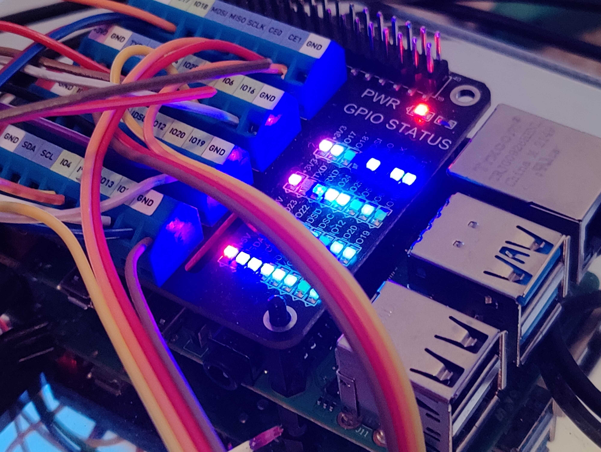
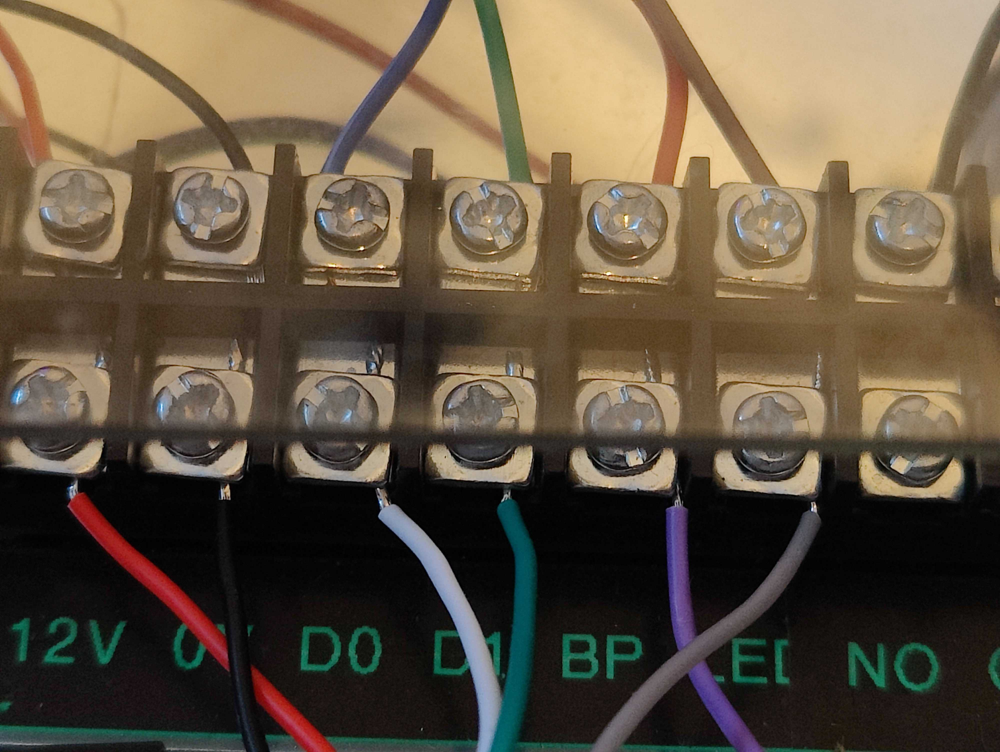
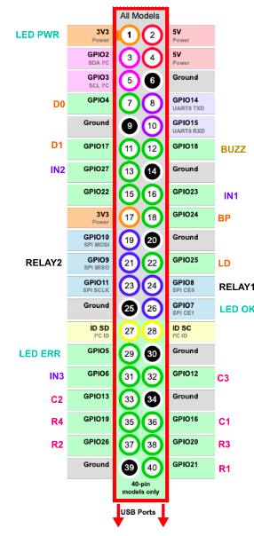
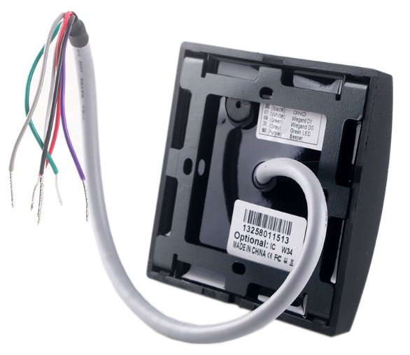
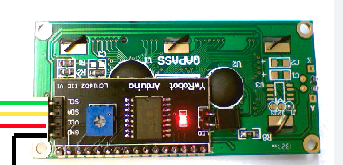
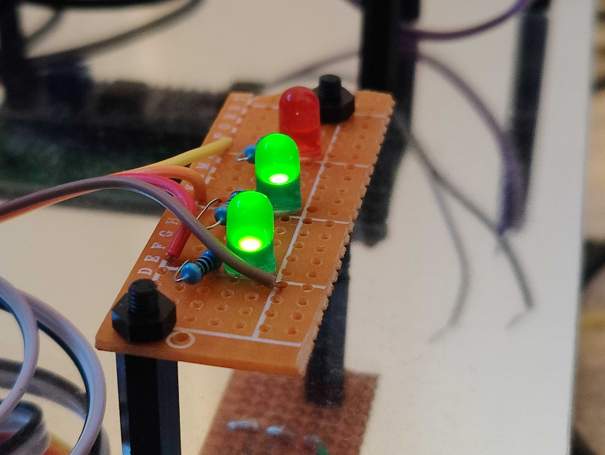
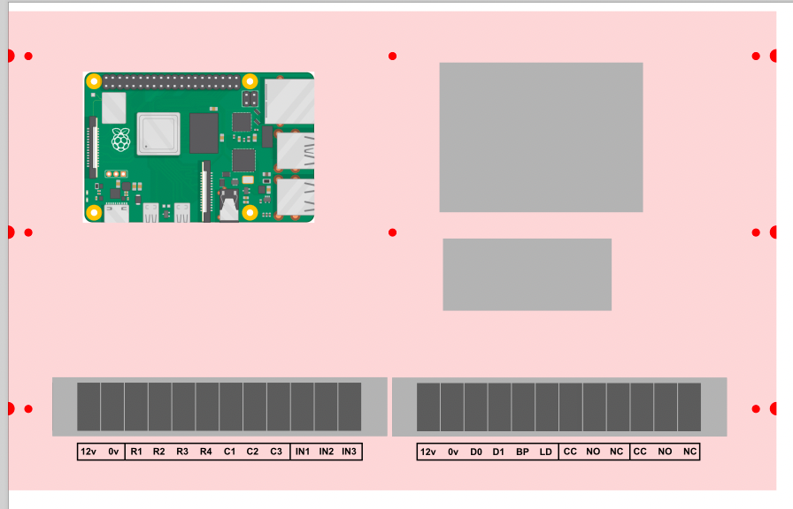
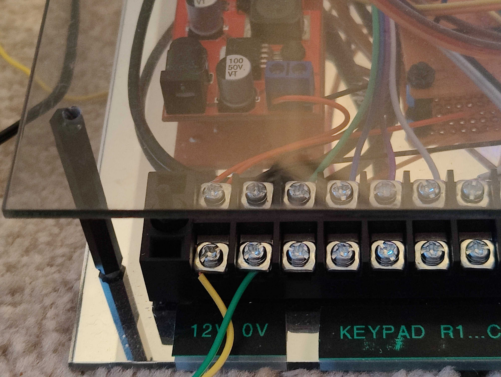
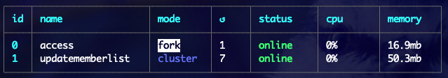

This is a fun project which shows how easy it is to make an entry system with industrial components and a Raspberry Pi.

The hackerspace has an entry system which has started to show its age - it requires a Pi 1 and occasionally breaks in new and exciting ways. It was therefore time for a new setup, one which was open for people to see how it works, and fix as things inevitably break.

The benefits of this system is that everything is modular, replaceable, easy to see and understand, easy to upgrade, and highly debuggable. Once it's made to your liking, it can be placed inside an enclosure or, as in my case, mounted in a clear acrylic housing for people to see.  

### Inputs
* Keypad (4x3 matrix type)
* [Wiegand](https://www.getkisi.com/guides/wiegand) reader (fob reader, but can be any Wiegand device)
* Request to Exit button
* Doorbell

### Outputs
* Two relays
  * One for the main lock
  * One for a future use - currently operating some lights to illuminate the step into the premises
* Beeper
* LED status lights
  * Power on
  * Run (shows the script is functional and not frozen/stopped)
  * Error (illuminates when error logs are written)

### Entry list
The system operates based off an entry list. The entry list is a CSV file that contains the permitted users. This file is regularly updated from an external source for this implementation, but can be a static file you write to manually, or you could make a simple CSV editing interface.
The main benefit of this approach is that if the internet connection fails when a user attempts to enter, the system will still function as it has a local cache of permitted users. If the entry list hasn't been updated in a while, because of some error fetching an updated version, we can raise an error.

## Hardware
The system has key parts that all bolt together and talk to one another. I'll address each aspect in turn.

### Mounting plate / backboard

You will need:
* backboard made of some stiff material (ideally acrylic)
* 2.5mm standoffs and fixings
* (optional) 3mm standoffs and fixings

The whole system is mounted a backboard. Acrylic is ideal as it can be cut by hand or laser and won't warp, but wood such as plywood, OSB, or even sheet metal will work too. 

* The backboard is just to hold the various components which connect to eachother electrically with jumper wires. 
* Decide if you want the finished product to be mounted in an enclosure:
  *  if so, cut your acrylic so that it fits inside the enclosure
  *  if not, you can make a protective enclosure from acrylic 
* The standoffs are so you can safely secure the different items to the backboard without risk of items shorting or touching the backboard.
* If you use mirror acrylic, the standoffs also allow a glimpse under the boards and gives a good effect.


<div style="clear:both"></div>

### Connections


You will need:
* [Barrier block connector blocks](https://thepihut.com/products/barrier-terminal-blocks)

To interface with the real world can be frustrating when the real world is dirty, and wires get pulled. To solve this problem, I've used barrier blocks so that all wiring inside the main unit is connected carefully, and then when installed, only the other side of the barrier block screws are used. This way if wires get pulled, it won't rip apart the more delicate connections on the boards.


Adding labels to the barrier blocks will help with installing and maintaining as it's clear what each pin does.

Important Note! If you aren't buffering the GPIOs, which provides a degree of protection from overvoltage, it's essential you label and are careful when connecting items. 


<div style="clear:both"></div>

### Raspberry Pi



You will need:
* A Raspberry Pi (running Raspberry Pi OS, or your favourite OS)
* (Optional) [A Raspberry Pi Screw Terminal HAT](https://thepihut.com/products/gpio-screw-terminal-hat)
* (Optional) [An EMMC module in place of an SD card](https://thepihut.com/products/raspikey-plug-and-play-emmc-module-for-raspberry-pi)

The first thing is getting a EMMC module - this is essentially a SSD in SD card format. It is faster, more reliable and resilient to power outages and file operations.

The Raspberry Pi is the brains of the system and will control all devices. I've used the GPIO Screw Terminal HAT for connections as I found it gives greater flexibility and ease of use - you can see at a glance what pin each device is connected to. Screw terminals are also more resilient than pin headers, but this is optional.


You may find there are lots of GPIO pins being required. This can be tricky to keep track of, so I downloaded an image of the Pi GPIO header, then annotated on each pin what I expect to connect to it.

I also recommend looking and referring to [Pinout.xyz](https://pinout.xyz/) to see what each pin does internally. Make note of which pins are used for i2c and keep those free so that they can be used later on if need be.

I made an attempt to group up devices to nearby pins, in this example the keyboard has rows R1-R4 and columns C1-C3 near the bottom of the GPIO.

The software will be explained later on. 


<div style="clear:both"></div>


### Fob reader
Important - make sure you get the right type of Wiegand reader!

There are (at least) two main standards for fob systems:
* 125kHz
* 13.56mHz
* and others


For this system, which uses fobs which are compatible with NFC, we are using 13.56mHz fobs and readers.

Note that Wiegand readers are sold often with two descriptors instead of frequencies:
* ID - 125kHz
* IC - 13.56 mHz



Make sure you get the right one and always follow the listing details - the output of the readers is the same, but a 125kHz reader won't read a 13.56mHz fob (and likewise the other way round).

Fob readers and Wiegand devices can be easily bought on sites such as eBay. Most if not all evices require 12v input, which we will deal with further down.

As they're potted, they are weather resistant and can be used outside. Most have a beeper which can be GPIO controlled. This doubles up as the beeper for the keypad as the two devices will be mounted on a wall near eachother. Some also have a Green LED which can be GPIO controlled.

Important note! Wiegand readers operate on these voltages:
* Power: 12v
* D0, D1, Beep, LED: 5V

The GPIO voltage for the Pi is 3.3v, so we need a level shifter (module easily bought from eBay) or resistive divider. Because of postal issues in the UK at the moment, I made a resistive divider.

This connects a 5k resistor from the Wiegand reader to the GPIO pin, then a 10k resistor from the GPIO pin to ground. This means of the 5v the Wiegand reader outputs, some gets sink to ground via the resistors with only 3.3v going to the GPIO. 

### Keypad


It's possible to get combined keypad and fob reader Wiegand devices, but in our case we have these split out.

The keypad we use is 4x3 in standard telephone layout with 1-3 at the top row through to "*", 0 and "#" on the bottom rows.

Note: The keypad I bought had the numbers in reverse order. To put them in correct order, I disassembled the keypad and switched keys around. The only caveat is that the arrows in the new configuration point inwards rather than outwards but this isn't an issue if you're not using arrows. 


The keypad I have also has the word "enter" and "clear" engraved onto the "#" and "*" keys respectively.

### LCD display


Entirely optional, but I have a soft spot for LCD displays. 

I used one which has a i2c backpack on it, so we only need two data pins to communicate with ir rather than the many wires you otherwise need. These are generic devices and can be bought on eBay.

There's a range of commands that can be used to turn the display on and off, display custom characters, and position text as you please.


### Relay board
Another generic module - these are easily found on eBay and come in many varieties. Make sure to get one which has mounting holes so it can be screwed to the backboard. 

### 12v to 5v DC-DC converter
Both Wiegand devices and locks usually require 12v input to run. Therefore we need a 12v supply. This can be done in two ways:
* Powering the system with 12v and then converting down to 5v for the Pi
* Powering the system with 5v (e.g. off USB) and then converting up to 12v for the reader

Which one you choose is up to you, but I went with powering the system off 12v as the lock I'm using requires 12v to operate. Locks can sink a lot of current, so a good power supply is essential.

### Lock
The main component to keep your door secure is a lock. This can be of any type but there are two main categories:
* Fail safe - these locks release if there's a power failure and require power to generate locking force.
  * These are good for internal doors
  * You may need a green "break glass" emergency release wired in series
  * Examples are magnetic locks
* Fail secure - these locks require power to release. In a power failure, they'll stay locked.
  * These are good for external doors.
  * You will need some mechanical override so if there's a power cut or the system fails, people can egress
  * Examples are gate locks

Consider all relevant regulations and failure scenarios when selecting a lock. The door in question for my project is street-facing, so I'm using a fail secure lock. This lock has a built in mechanical override, as well as a 12v release coil. Therefore it can be released by software for people wishing to enter, and released physically for people inside wishing to egress.

### Request to exit button
This is often a green mushroom button that can be pressed (or often hit) to release the doors. This doesn't interact with the lock wires physically unlike the "break glass" emergency buttons. This is a simple push button which the software monitors and releases the lock when pushed.

### Wires
I just used standard jumper wires for all parts of the internal system. For external parts, I used two core flex for the 12v power and locks, for the keypad and Wiegand reader I used alarm cable but you can also use ethernet cable.

### Status lights


I'm a fan of systems being visually intuitive, and so I made three status lights to give an "at a glance" overview of the system:

The top LED (red) is the Error LED, and this flashes when there's content written to the error log (the script just checks the size of error.log every few minutes and then sets an internal variable that is referenced every few ms - this keeps the file from being constantly read).

The middle LED (green) is the Run LED and this flashes every second so that it's clear the script is running as it's actively controlling the LED. If this LED isn't flashing, the script isn't running!

The bottom LED (green) is the power LED and is connected to the 3.3v rail on the Pi, this just proves the Pi has power.

This is just made of veroboard, three LEDs and three resistors. 

## Mounting the hardware
This step is as much art as engineering. You can if you wish measure up your boards and design a backplate tailored to the size requirements as I did, or you can roughly place the items and see what looks good.




Be sure to leave plenty of space between items for wires to go.

Once you have everything vaguely placed, use a pen such as a Sharpie to mark where holes should go. You can measure things out if you want things aligned, or just eyeball each board's placement. Use a 2.5mm or 3mm drill bit depending on what size hole each item has.

The Raspberry Pi "B" boards all have 2.5mm holes, so a 2.5mm hole on the backboard, and then 2.5mm spacers will mean everything fits together snugly.

Using your 2.5mm spacer and fixings kit, put a screw through the back of the board and then mount a small spacer, then tighten, then mount the item, then add a nut. 

### Making a front cover


If your backboard won't be going in an enclosure, it's a good idea to mount a front cover to provide impact protection to the items. This also helps keep curious fingers away from wires. 

To do this:
  * Cut a piece of clear or translucent acrylic to the same dimensions as the backboard 
  * Make four holes in each corner of the backboard and front cover
  * Put a screw through the backplate, then, using tall spacers from your 3mm standoff kit (you can also use a 2.5mm standoff kit but 3mm is a bit more rugged), make up enough height from the backboard so that the front cover won't crush any wires or items
  * For the last standoff, use a female-female spacer so that you can then screw on the front cover with a screw to give a nice finish from the front.


When your project is done, you can simply screw on the front cover. 

If you want, cut some sides from acrylic and use acrylic weld to glue to the front cover. This way, with the cover off, all sides of the system are accessible for maintenance, but when the cover is on, all sides are protected. 


## Setting up the Pi
### Language and frameworks
The most logical option for this project was using Javascript, and Node.js:
* JS has a low barrier to entry so makes maintaining easier
* Asynchronous functions are easy - we can use `setTimeout` and have an event-driven script
* There's plenty of packages and libraries for everything from Wiegand to making HTTP requests with Axios. 

### Getting the Pi set up
In general steps:
* Set up your pi with Raspberry Pi OS 
* Get your Pi connected to WiFi/Ethernet
* SSH into your Pi
* Install Node.js (which also installs npm for installing packages)

### Cloning the repo
* Run `git clone https://github.com/conorriches/doorbotjs.git`
* This will create a folder called `doorbotjs` with the code in it, but you can specify a different folder if you'd like to in the `git clone` command.
* Change directory to the new folder: `cd doorbotjs`
* Install dependencies with `npm install`

### Processes needed
We have two processes:
* Access
  * This is the main access control script. It monitors inputs, controls outputs, and makes decisions on who or who may not pass.
* UpdateMemberList
  * This is run as a cron task, that is, it runs every few minutes
  * This updates the CSV of allowed people from our central source
  * If you don't have a central CSV of users, you can omit this task by deleting it from ecosystem.config.cjs
  * If you want to make a script that does update the local allowed-users file, this is where it should be. 

### Keeping your script constantly alive 


Some people may go to great lengths to live forever, fortunately for us, we can keep our script alive by using `pm2`. This should be installed globally using the command:

`npm install pm2 -g`

PM2 is a process manager, and it's job is to run processes, and restart them if they fail. It also provides useful logging and stats on our processes memory requirements with numerous configurations.

I've created a file `ecosystem.config.cjs` which details the processes we want to run.

To initialise PM2, simple call:
`pm2 start ecosystem.config.cjs`

You can then inspect the running processes with the following commands:
* `pm2 logs` will show you the various logs, including things logged to console, and error logs
* `pm2 list` will show you a list of processes
* `pm2 show <ID>` will show you detailed stats for a specified process
  * ID can be item ID (0,1,etc) or name (access)
* `pm2 flush` will flush any logs
* `pm2 restart <ID>` will manually restart a process if you want to make any changes locally (ideal for debugging but make sure to commit any changes!)


## The code
The code for this project [lives on GitHub](https://github.com/conorriches/doorbotjs).

The general gist of the code is the top level directory contains the main services, and then under `src` are the classes that represent real life things:
* Keypad
* Wiegand
* LCD
* Timed relay

I've used callbacks as a way to keep the meaty functions in the main file, while exporting all the implementation detail to external files:
For example, the Wiegand file is just:
```javascript
"use strict";

import WiegandReader from "wiegand-node";

export default class Wiegand {
  constructor({ pinD0, pinD1, validateCallback }) {
    this.fobReader = new WiegandReader({ d0: pinD0, d1: pinD1 });
    this.fobReader.begin();

    this.fobReader.on("reader", (idDec, idRFID, idHex) => {
      validateCallback(idHex);
    });
  }
}
```
This just passes the pins the Wiegand reader is connected to into the library we are using, and passes a callback to the "reader" event, returning the fob ID as hex.  

### Validating Entries
Things get more interesting in `access.js` when we validate:

```javascript
...
entryCodeExistsInMemberlist({
    entryCode: entryCode.toLowerCase(),
    isKeycode: isKeycode,
}).then((memberRecord) => {
  ...
  grantEntry();
  ...
});

```

What is inside `entryCodeExistsInMemberlist`? Here we validate all inputs - both keypad codes and fob codes:

```javascript
const entryCodeExistsInMemberlist = ({ entryCode, isKeycode = false }) => {
  return new Promise((resolve, reject) => {
    fs.readFile("members.csv", "utf8", (err, data) => {
      if (err) {
        reject();
      }

      parse(data, function (err, records) {
        if (err) {
          reject();
        }

        records.forEach((record) => {
          const [memberCodeId, announceName] = record;

          if (isKeycode && memberCodeId.startsWith("ff")) {
            if (memberCodeId.slice(2) === entryCode) {
              resolve({
                memberCodeId,
                announceName
              });
            }
          }

          if (!isKeycode && !memberCodeId.startsWith("ff")) {
            if (memberCodeId.slice(0, 8) == entryCode.slice(0, 8)) {
              resolve({
                memberCodeId,
                announceName
              });
            }
          }
        });

        reject("no record found");
      });
    });
  });
};

```

We return a Promise which means the calling function will only proceed once we call either `reject` or `resolve`. If we call `resolve` we pass in an object with the details of the person who entered.

To work out whether to admit or deny entry:
* We open `members.csv`
* Reject our promise if there's an error, this will deny entry
* For each record (which will be in the format of `fobId, username`)
  * check whether it's a keypad code or a fob ID 
  * consider the correct characters of the stored code to what was entered.  

The part that may be confusing with the above is how codes are stored. Rather than have a file full of fob IDs and a file full of keypad access codes, it makes sense to combine the file to just one access file that comes from our source of truth.

To distinguish between keypad codes and fob codes, all keypad codes start with `ff` which no fob ever will, due to the specification on fob IDs.

E.g.
* `ff12345678` will match keypad entry `12345678`
* `aabbccdd` will match fob `aabbccdd`

Therefore, when we validate some input, we set the `isKeycode` flag accordingly, which then checks if a line starts with `ff` before trying to validate the user input against it.

Likewise, if scanning a fob, any line starting with `ff` is ignored as it's not a fob code.


`grantEntry` is the bit that fires the lock, and inside is just:

```javascript
const grantEntry = () => {
  lock.trigger();
  strike.trigger();
  led_outside.trigger({ duration: 5000 });
  setTimeout(() => buzzer_outside.trigger({ duration: 50 }), 100);
  setTimeout(() => buzzer_outside.trigger({ duration: 50 }), 200);
  setTimeout(() => buzzer_outside.trigger({ duration: 50 }), 300);
};
```

* `lock` is an instance of `TimedOutput`, and calling `trigger()` will fire it for the time defined at instantiation, in this case 0.5s.
* `strike` is the same, but set to fire for 10s
* `led_outside` connects to the Wiegand "LED" input, which makes the green LED illuminate so the user knows they may enter
* the three `setTimeout` lines are a cheap way to get the outside buzzer (connected to the Wiegand "Beep" input) to chirp thrice on success 

### TimedOutput
This class aims to simplify the act of having a relay fire for a given amount of time before returning to it's initial state.

```javascript
"use strict";

import { Gpio } from "onoff";

export default class TimedOutput {
  constructor({ pin, duration = 50 }) {
    this.timeout = 0;
    this.output = new Gpio(pin, "high", "none", { activeLow: true });
    this.duration = duration;
    this.blocked = false;
  }

  trigger({ duration = 0, blocking = false }) {
    if (this.blocked) return;
    if (blocking) this.blocked = true;
    if (this.timeout) clearTimeout(this.timeout);

    this.output.write(1, () => {
      this.timeout = setTimeout(() => {
        this.output.write(0);
        this.timeout = 0;
        this.blocked = false;
      }, duration || this.duration);
    });
  }
}
```
The main parts
* A blocking call means the output will stay on for the specified time and won't accept future triggers until it's done
  * e.g. You get denied entry and the buzzer is beeping loudly. Pressing a keypad key (which calls a short pip to the buzzer) should not cancel this long beep out!
* If the output is active and not blocked, extend the output so that multiple calls maintain the output state
  * e.g. For the Request To Exit button - pressing regularly will keep the lock open, rather than the numerous timeouts firing as the user presses the button multiple times
* Set the output to high, and then immediately after set a timeout for it to be set low
* High and Low here are inverted, as we initialised the `Gpio` with `{ activeLow: true }`
  * Relay boards are common in design, and will trigger the relay when you **ground** the input wire
  * Therefore, the pin being LOW would trigger the relay
  * Therefore, we set `activeLow` to true so our logic can refer to High (1) and Low (0) without worrying about this physical implementation detail.  


### Notable comments on security
The method of checking the fob ID is similar to the existing system, and hasn't been updated in this rebuild, which focuses on reliability and maintainability. In both systems we just check the fob ID.

Fob IDs can be spoofed in the same way as keypad codes can be randomly entered. Therefore we have two considerations to make:
* Entering an incorrect keypad code or fob ID should block the system to slow down attackers
* If someone is going to that much effort to spoof a fob to get into a hackerspace, they probably belong on the inside anyway!

The advent of Flipper 0 changes things somewhat as it's now easier for anyone to just start spoofing fob IDs. That's why the next upgrade to the system will be some additional layer of security such as a signed hash so we can more securely prevent people from spoofing fobs.

However, with hundreds of members, this isn't quick or easy. If starting from scratch, it could be worth investigating how to increase your security, for example by using [mifare-classic](https://www.npmjs.com/package/mifare-classic) to write data to the tag upon registration which is then verified on reading.


### Repo README docs
Notable README files live under `/docs`:
*  [notes on the code](https://github.com/conorriches/doorbotjs/blob/main/docs/code.md)
*  [user manual](https://github.com/conorriches/doorbotjs/blob/main/docs/manual.md)
*  [terminology for people not familiar](https://github.com/conorriches/doorbotjs/blob/main/docs/terminology.md)
*  [wiring diagram for getting started](https://github.com/conorriches/doorbotjs/blob/main/docs/wiring.md)
