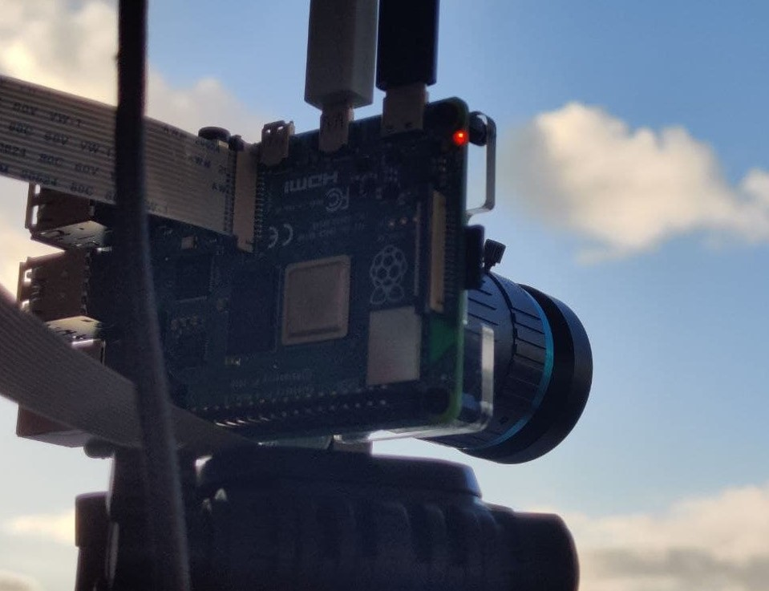

Let's face it, birdwatching takes time. A **whole lot** of time.

Annoyingly for us, birds have evolved not make appearances when there's a big mammal eagerly waiting for them, so what better to do than to automate the hell out of it? Raspberry Pi's rarely move by their own accord, so they're perfect for setting up without spooking wildlife.

## Project overview


We are going to use a Raspberry Pi with an HQ Camera, paired with TensorFlow Lite machine learning to identify when there's a bird in front of the camera, and take a photo when it sees one. Optionally, we can use a touchscreen to make the process of using the camera much easier.

The Raspberry Pi HQ camera lens has a fixed focus, so it should be focused on a set point, such as a birdbath, feeder, or table where birds are likely to visit when left alone. You can also just leave the birbcam on the (dry) grass and place some seed in front of it and you'll be sure to attract at least a pigeon.  

We are going to use the new [libcamera](https://www.raspberrypi.com/documentation/accessories/camera.html#libcamera-and-libcamera-apps) stack - so make sure you have a recent version of Raspberry Pi OS installed and everything is up to date. 

<div style="clear:both"></div>

## Parts required
* A Raspberry Pi, with up-to-date OS, connected to
* Pi HQ Camera, with a
* 16mm lens, mounted on a 
* tripod
* optionally, a [touchscreen display](https://thepihut.com/products/3-5-ips-dpi-capacitive-touchscreen-display-for-raspberry-pi) (more on this later)

There's no coding needed to get it up and running, but some proficiency with Raspberry Pi will come in handy.

**Note: You don't need to use the HQ camera if you're on a budget - a standard camera module will functionally work the same, just not the same photo quality!**

## Prerequisites
This guide doesn't cover everything, so here's some good things to start with:
* [Setting up a Raspberry Pi](https://www.raspberrypi.com/software/)
* [Installing a Raspberry Pi camera](https://www.raspberrypi.com/documentation/accessories/camera.html#installing-a-raspberry-pi-camera)
* [Enabling ssh](https://roboticsbackend.com/enable-ssh-on-raspberry-pi-raspbian/)
* Basic linux commands

-----

## Step Zero - Optional - Get the touchscreen working
I chose a 3.5inch display which plugs into the 40 pin GPIO header as we won't be using the GPIO for anything else and it means the entire camera and screen construction will nicely hold together as one piece. We've essentially just made a really fancy digital camera!


Getting the touchscreen working relies on following manufacturer guidelines, for [the one I'm using](https://thepihut.com/products/3-5-ips-dpi-capacitive-touchscreen-display-for-raspberry-pi), I followed [the instructions on their Wiki](https://www.waveshare.com/wiki/3.5inch_DPI_LCD).

I found the screen was extremely dim, so followed their advice on setting brightness to maximum using PWM. I found the screen kept resetting to the dim brightness on reboot, so I saved the command inside of `/etc/rc.local` which gets run on boot and will auto-set brightness every time:

* Run `sudo nano /etc/rc.local` to edit the file
* Enter `gpio -g pwm 18 100` **before** the line saying `exit 0`

### Making the screen comfortable to use
Things will be tiny, so let's make them more usable!

* Using the Main Menu (Raspberry Pi logo top left of the screen), select Preferences, Appearance Settings.
* Select the Defaults tab
* Select the Small Screens option, and everything should resize nicely!

<div style="clear:both"></div>

## Step one - get the camera working and set up
The main bit of the project is the camera, so install the HQ camera module as per the guidance, and boot the Raspberry Pi. 


If you don't have a touchscreen, plug in a monitor, mouse and keyboard to the Pi so we can test if the camera works.

To do this, use the pre-installed
[libcamera-hello](https://www.raspberrypi.com/documentation/accessories/camera.html#libcamera-hello) by running `libcamera-hello -t 0`

* This will indefinitely show the camera output to the desktop screen
* Play with the camera! 
* This is a really fun time to see how the lens works, play with adjustment, focus, light levels etc. 

Save the captured image by running [libcamera-jpeg](https://www.raspberrypi.com/documentation/accessories/camera.html#libcamera-jpeg) by running `libcamera-jpeg -o test.jpg`. Practice taking photos and viewing the saved image on the Pi. 

<div style="clear:both"></div>

### Copying images from the Pi to another device
To really enjoy and share the photos you take with `libcamera-jpeg` you'll want to copy them to your computer or device. 

### Backup to the cloud
`rsync` is a really useful tool to sync files from one place to another. You can then use `rclone` to push photos to places like Google Drive or Dropbox.
Follow the guide here on getting `rsync` and `rclone` set up:
[https://raspberrypi-guide.github.io/filesharing/file-synchronisation-rsync-rclone#uploading-data-to-the-cloud](https://raspberrypi-guide.github.io/filesharing/file-synchronisation-rsync-rclone#uploading-data-to-the-cloud)

### Locally transferring photos over FTP
You'll need the Pi and other device connected to the same WiFi router, have SSH enabled on the Pi, and a client on your other device:
* On PC, you can install FileZilla
* On mobile, you can install a SSH/SFTP app

Once installed:
* Set up a connection to the Pi using the [Raspberry Pi's IP address](https://www.techworked.com/find-ip-address-of-headless-raspberry-pi/). The username/password is the same as when you SSH into the Pi, default is `pi` / `raspberry`
* Select SFTP
* You should see a file listing when you connect

Practice copying over photos, it's a bit manual but you're now up and running.

### Manually doing it with SCP
If you don't want to pull photos and instead want to push them, you can use `scp` to **s**ecurely **c**o**p**y photos from the Pi to another device. 


## Step two - install TensorFlow Lite
The Raspberry Pi camera is more like a video camera than a still camera, so we need a way to trigger the script to take static photographs. Instead of using general motion detection, we will specifically detect birds so we don't need to filter through thousands of images of leaves moving.

The first step is to [install TensorFlow Lite following the instructions](https://lindevs.com/install-precompiled-tensorflow-lite-on-raspberry-pi/).

TensorFlow Lite is based on machine learning and can be used to identify when there's a bird in front of the camera. It doesn't know what a bird is yet, but we can later on give it some models that describe the concept of a bird, and it'll be able to do the magic needed to then use those models to say when it can see a bird.


## Step three - detection software with libcamera-apps
As you'll have seen, `libcamera-apps` come pre-installed with Raspberry Pi OS, so we can just use [libcamera-detect](https://www.raspberrypi.com/documentation/accessories/camera.html#libcamera-detect) to open the camera up, and plug into TensorFlow Lite to identify when a bird is on screen. 

While `libcamera-apps` comes with the OS, `libcamera-detect` does not come pre-built so we will need to build it, folding in our now-installed TensorFlow Lite installation. 

* Rebuild libcamera-apps
    * Start by [rebuilding libcamera-apps without libcamera](https://www.raspberrypi.com/documentation/accessories/camera.html#building-libcamera-and-libcamera-apps) 
    * Run `sudo apt install -y libcamera-dev libepoxy-dev libjpeg-dev libtiff5-dev` 
* Make sure you continue on to build [libcamera-apps](https://www.raspberrypi.com/documentation/accessories/camera.html#building-libcamera-apps)

  Install the dependencies: `sudo apt install -y cmake libboost-program-options-dev libdrm-dev libexif-dev`
  
  Then you'll need to get prepared to build by downloading the code for `libcamera-apps`:
  ```
  cd
  git clone https://github.com/raspberrypi/libcamera-apps.git
  cd libcamera-apps
  mkdir build
  cd build
  ```
* Build it real good
  * Run the command:
`cmake .. -DENABLE_DRM=1 -DENABLE_X11=1 -DENABLE_QT=1 -DENABLE_OPENCV=0 -DENABLE_TFLITE=1`
  * This last flag means that your installed TensorFlow Lite is enabled with the build, meaning that `libcamera-detect` will be able to use it.
* Finish the process off
  ```
  make -j4  # use -j1 on Pi 3 or earlier devices
  sudo make install
  sudo ldconfig
  ```

Breathe - that's the tricky part done!

## Step Four - when is a bird a bird?
So far we have most of the pieces in place but the software still doesn't know what a bird is. 


Therefore, we need a model which describes what a bird is, and fortunately the hard work is done for us as online there exists a library of common objects which has pre-trained models which we can download.


[Common Objects In Context](https://cocodataset.org) (COCO) is a machine learning dataset of common objects (including birds) that we can use without having to train up our own model of a bird. From exploring the dataset, it looks like it will work perfectly.

For example, this image has multiple items identified:
https://cocodataset.org/#explore?id=12805

The context is nothing if not diverse either:
https://cocodataset.org/#explore?id=43511

You'll want to download the models and labels file somewhere sensible, I've put them in `/home/pi/models`:
[Follow the instructions here](https://github.com/EdjeElectronics/TensorFlow-Lite-Object-Detection-on-Android-and-Raspberry-Pi/blob/master/Raspberry_Pi_Guide.md#option-1-using-googles-sample-tflite-model)

Create a file called `object_detect_tf.json` and paste the following in:
```
{
    "object_detect_tf":
    {
        "number_of_threads" : 2,
        "refresh_rate" : 10,
        "confidence_threshold" : 0.5,
        "overlap_threshold" : 0.5,
        "model_file" : "/home/pi/models/coco_ssd_mobilenet_v1_1.0_quant_2018_06_29/detect.tflite",
        "labels_file" : "/home/pi/models/coco_ssd_mobilenet_v1_1.0_quant_2018_06_29/labelmap.txt",
        "verbose" : 1
    }
}
```
This will be used as a "post process file", which means that it's used when the camera is running. It has a model and labels file, so it can understand what it sees and match it up with a label. There are some parameters which you can play with, but these worked well for me.

## Step Five - let's go!
So far we have:
* Installed a camera and checked it works
* Copied photos over to another device for viewing
* Installed TensorFlow Lite which does the fancy object detection bit
* Built `libcamera-detect` which connects to the camera and runs the output through TensorFlow Lite

We will now run the command that will:
* start the camera
* start watching for birds
* take a photo when one is identified

That's done by running the following command:
`libcamera-detect -t 0 -o ~/birb%04d.jpg --lores-width 400 --lores-height 300 --post-process-file object_detect_tf.json --info-text "Detecting Birds!" --object bird`

You can tweak the parameters by looking at [the libcamera-detect docs](https://www.raspberrypi.com/documentation/accessories/camera.html#libcamera-detect) and [common command line options](https://www.raspberrypi.com/documentation/accessories/camera.html#common-command-line-options):
* `-t 0` 
  * time is zero
* `-o birb%04d.jpg`
  * Output file is a 4 digit number that increments. This means you don't have to manually name each image - it does it for you. **Note:** the counter resets from 0 when you run the script so will overwrite images with the same name.
* `--lores-width`/`--lores-height` 
  * This is the image sized used by TensorFlow to detect birds. When it recognises a bird, it'll then take a full scale photo.
* `--post-process-file object_detect_tf.json`
  * we are telling it what to do
* `--info-text Detecting`
  * Shows in the info bar title on the window so we can see it's working
* --object bird
  * telling it what to look out for! You can find more labels in the labels file if you want to spot other things

## Step Six - Optional - Touchscreen shortcuts
If you have a touchscreen, you can use desktop shortcuts to run commands such as
* `libcamera-hello -t 30` as a viewfinder and way of setting focus when on site
* `libcamera-detect ...` to run the bird spotting program!

### Create a shell script
To keep things separated, we will create a shell script in our home directory (`/home/pi`) that will run the `libcamera-detect` command. Create the file by running `nano ~/detect.sh` and paste into it the following:

```
#!/bin/bash

DATE=$(date +"%Y-%m-%d_%H%M")
libcamera-detect -t 0 --lores-width 400 --lores-height 300 --post-process-file object_detect_tf.json --object bird -o birds/$DATE-%04d.jpg
```
* This will get run the `libcamera-detect` application
* It will save the images with a file name that starts with the current date and ends with the increment number, e.g. `2020-04-14_1015_0001.jpg` 
* That way we won't get any files overwritten even if there are two photos taken in the same minute, and even if we stop and restart the script.
* Note: the date is generated once when the script is started, so it won't update the time and date on each photo taken, but they will still be incremented

Now do the same for `libcamera-hello` - create a file called `viewfinder.sh` with the `libcamera-hello -t 30` command inside.
Next we will get these shell scripts to run when a desktop shortcut is pressed.

### Creating desktop shortcuts
* Navigate to the Desktop directory `cd ~/Desktop` - anything saved here will show up on the Desktop.
* Create a new file: `nano Detect.desktop`
* Paste into it:
  ```
  [Desktop Entry]
  Comment=Preview
  Terminal=true
  Name=Detect
  Exec=lxterminal -e "/home/pi/detect.sh"
  Type=Application
  Icon=/usr/share/raspberrypi-artwork/raspberry-pi-logo-small.png
  ```
* Make them run with one press
  * Open the file browser
  * Edit menu -> Preferences
  * Select the first checkbox "Open files with single click"
  * Select the option lower down not to ask options when opening executables
* Do the same for `Viewfinder` which will run the `viewfinder.sh` file which will in turn run `libcamera-hello`


You now have two icons on the Desktop, one will open up `libcamera-hello` and acts as a viewfinder, and the other which will open up `libcamera-detect`.

## Tips on using the camera
* Use a good tripod so the camera is steady and resistant to any wind you'll likely get - you don't want it falling over!
* The screws that came with the [mounting plate for the HQ camera](https://thepihut.com/products/mounting-plate-for-high-quality-camera?variant=31867507114046) are plastic, and I was really disappointed when they failed - so maybe upgrade to some brass screws and standoffs - these can be found anywhere online.
* Focus the camera on a specific point, maybe a pile of seed. This will ensure they're in best focus.
* Most of all, have fun!
* Share your photos! 

## Future steps...
This is just the start of a much bigger project - what we have done here works with really good results. 

How about:
* Making it post to Telegram when a bird is identified?
* Making this setup work as a security camera (hint: set `--object person`)
* Recording a short video when a bird is detected
  * How about getting it to pre-record 5s before?
* Auto-cropping the image with the bird in the centre?
* Using OpenCV to draw on the images
* Could it detect the species of bird and name the file?

There's also a load of other options on the utilities above to play around with.

And this is all without having to write a script!

**Happy birdwatching!**
