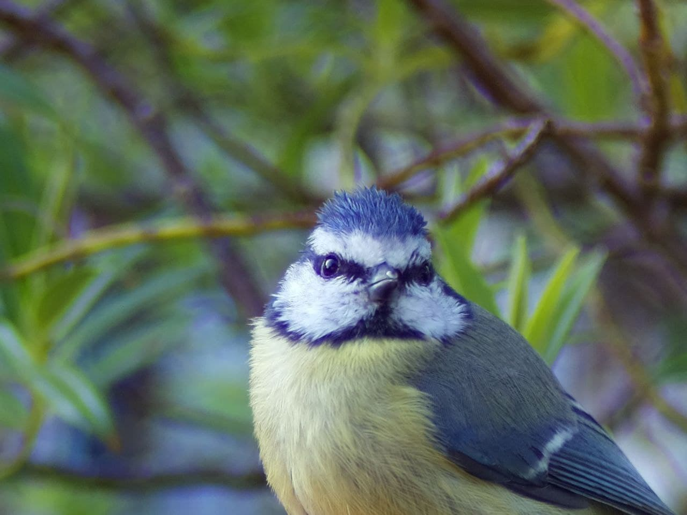
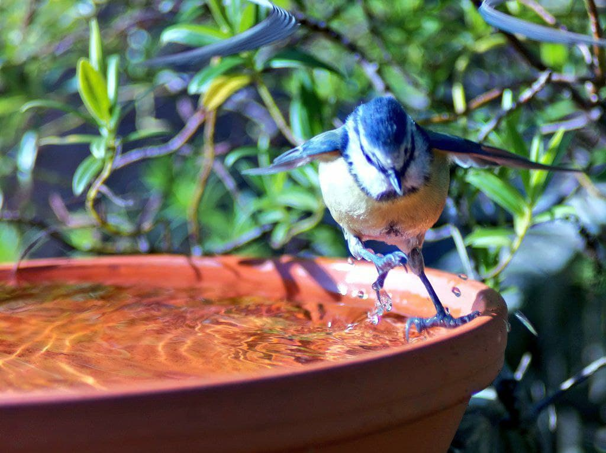

Let's face it, birdwatching takes time. A **lot** of time.

And often, when they know you're waiting they won't show up no matter how much bird food you put out. 

So what better to do than to automate the hell out of it? Raspberry Pi's rarely move by their own accord, so they're perfect for setting up without spooking wildlife.

## Project overview


We are going to use a Raspberry Pi with an HQ Camera, paired with TensorFlow Lite machine learning to identify when there's a bird infront of the camera, and take a photo when it sees one.

The camera should be facing something like a birdbath, feeder, or table where birds are likely to visit when left alone. 

We are going to use the new [libcamera](https://www.raspberrypi.com/documentation/accessories/camera.html#libcamera-and-libcamera-apps) stack - so make sure you have a recent version of Raspberry Pi OS installed and everyting is up to date. 

<div style="clear:both"></div>

## Parts required
* A Raspberry Pi, with up-to-date OS, connected to
* Pi HQ Camera, with a
* 16mm lens, mounted on a 
* tripod

There's no coding needed to get it up and running, but some proficiency with Raspberry Pi will come in handy.

## Prerequisites
This guide doesn't cover everything, so here's some good things to start with:
* Setting up a Raspbery Pi
* [Installing a Raspberry Pi camera](https://www.raspberrypi.com/documentation/accessories/camera.html#installing-a-raspberry-pi-camera)
* Enabling ssh
* Basic linux commands

-----

## Step one - get the camera working and set up
First of all, install the camera module, and boot the Raspberry Pi. Use a screen for this step.


To test if the camera works use the pre-installed
[libcamera-hello](https://www.raspberrypi.com/documentation/accessories/camera.html#libcamera-hello) by running `libcamera-hello -t 0`
* This will indefinitely show the camera output to the desktop screen
* Play with the camera! 
* This is a really fun time to see how the lens works, play with adjustment, focus, light levels etc. 

Save the captured image with [libcamera-jpeg](https://www.raspberrypi.com/documentation/accessories/camera.html#libcamera-jpeg) by running `libcamera-jpeg -o test.jpg`. Practice taking photos and viewing the saved image on the Pi.

<div style="clear:both"></div>

### Copying images from the Pi to another device
To really enjoy the photos you take with `libcamera-jpeg` you'll want to copy them to your computer or device. One way is with `scp`, another is using SFPT.

To do this you'll need the Pi and other device connected to a WiFi router, SSH enabled on the Pi, and a SSH client on your other device:

* On PC, you can install FileZilla
* On mobile, you can install a SSH/SFTP app

Once installed:
* Set up a connection to the Pi using the [Raspberry Pi's IP address](https://www.techworked.com/find-ip-address-of-headless-raspberry-pi/). The username/password is the same as when you SSH into the Pi, default is `pi`/`raspberry`
* Select SFTP
* You should see a file listing when you connect

Practice copying over photos, it's a bit manual for now but you're now up and running.


## Step two - install TensorFlow Lite
We need a way to detect birds specifically, so we don't get thousands of images of leaves moving. The first step is to install TensorFlow Lite - this is based on machine learning and can be used to identify when there's a bird infront of the camera. It doesn't know what a bird is, but we can later on give it some models and it'll be able to do the magic needed to then use those models to spot a bird.

* Follow [the instructions](https://lindevs.com/install-precompiled-tensorflow-lite-on-raspberry-pi/) to install TensorFlow Lite.

## Step three - rebuild libcamera-apps
We can use [libcamera-detect](https://www.raspberrypi.com/documentation/accessories/camera.html#libcamera-detect) to open the camera up, and plug into TensorFlow Lite to identify when a bird is on screen.  

This does not come pre-built, so we will need to build it, folding in our now-installed TensorFlow Lite installation. 

* Rebuild libcamera-apps
    * Start by [rebuilding libcamera-apps without libcamera](https://www.raspberrypi.com/documentation/accessories/camera.html#building-libcamera-and-libcamera-apps) 
    * Run `sudo apt install -y libcamera-dev libepoxy-dev libjpeg-dev libtiff5-dev` 
* Make sure you continue on to build [libcamera-apps](https://www.raspberrypi.com/documentation/accessories/camera.html#building-libcamera-apps)

  Install the dependencies: `sudo apt install -y cmake libboost-program-options-dev libdrm-dev libexif-dev`
  
  Then you'll need to get prepared to build by downloading the code for `libcamera-apps`:
  ```
  cd
  git clone https://github.com/raspberrypi/libcamera-apps.git
  cd libcamera-apps
  mkdir build
  cd build
  ```
* Build it real good
  * Run the command:
`cmake .. -DENABLE_DRM=1 -DENABLE_X11=1 -DENABLE_QT=1 -DENABLE_OPENCV=0 -DENABLE_TFLITE=1`
  * This last flag means that your installed TensorFlow Lite is enabled with the build, meaning that `libcamera-detect` will be able to use it.
* Finish the process off
  ```
  make -j4  # use -j1 on Pi 3 or earlier devices
  sudo make install
  sudo ldconfig
  ```

## Step Four - when is a bird a bird?
So far we have most of the pieces in place but the software still doesn't know what a bird is. Therefore, we need a model which describes what a bird is, and fortunately the hard work is done for us as online there exists a library of common objects which has pre-trained models which we can download.

Common Objects In Context (COCO) is a machine learning dataset of common objects (including birds) that we can use without having to train up our own model of a bird. From exploring the dataset, it looks like it will work perfectly.

For example, this image has multiple items identified:
https://cocodataset.org/#explore?id=12805

The context is nothing if not diverse either:
https://cocodataset.org/#explore?id=43511


## Step Five - let's go!
We now run the command that will:
* start the camera
* start watching for birds
* take a photo when one is identified

That's done by running the following command:
`libcamera-detect -t 0 -o birb%04d.jpg --lores-width 400 --lores-height 300 --post-process-file object_detect_tf.json --object bird`

* `-t 0` 
  * time is zero
* `-o birb%04d.jpg`
  * Output file is a 4 digit number that increments. This means you don't have to overwrite images or work out what to name them - it does it for you
* `--lores-width`/`--lores-height` 
  * This is the image sized used by TensorFlow to detect birds. When it recognises a bird, it'll then take a full scale photo.
* `--post-process-file object_detect_tf.json`
  * we are telling it what to do
* --object bird
  * telling it what to look out for! 

## Moving on...
This is just the start of the project, it's rough and ready but works with really good results. 

How about:
* Making it post to Telegram when a bird is identified?
* Making this setup work as a security camera (setting `--object person`)
* Recording a short video when a bird is detected
  * How about getting it to pre-record 5s before?
* Auto-cropping the image with the bird in the centre?
* Using OpenCV to draw on the images

There's also a load of other options on the utilities above to play around with.

And this is all without having to write a script!


Hope you enjoy your time in the garden with birds!