## Introduction
After living in Manchester for a while, you're bound to start noticing some cool street names. After a while, five years in my case, I found myself excitedly talking to a friend about my favourite street names. I made a list on my phone which sat there for over a year...

I finally compiled my 10 favourite streets in Manchester. The criteria is:
* It must have an interesting name
* If it has interesting history that's a bonus
* If there's no history then it needs to have an extra special name.

Names should be amusing, intriguing, curious, or down right strange.

So after over a year of pondering, here we go...

## 10 - Pigeon Street

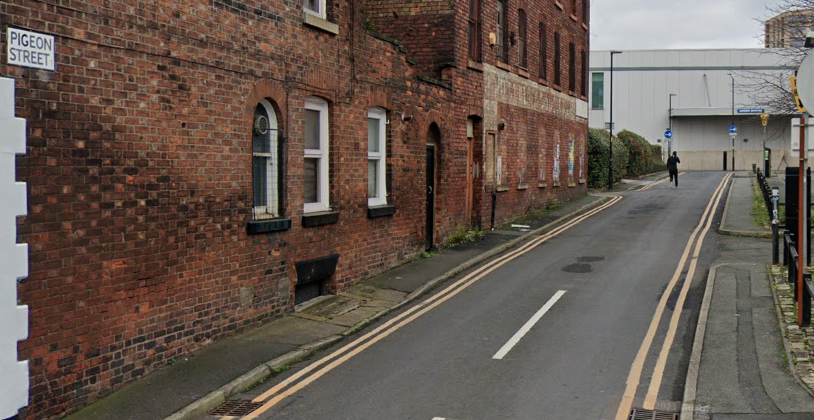

A pretty accurate street name for all of Manchester. Curiously when I've passed through I've never noticed any pigeons, let alone any doing anything of note. We all know that Piccadilly Gardens is the global source of pigeons, but maybe they're just assembled there and in fact originate from Pigeon Street. 

Even more curious there's an [entire website](https://pigeonstreet.com/manchester.php) about Pigeon Street - though it turns out it's actually about a TV series from the 1980s. I'm assuming the street came first.

However on this website are photos taken by someone else from the hackerspace I go to. Small circles...

## 9 - Cotton Street 

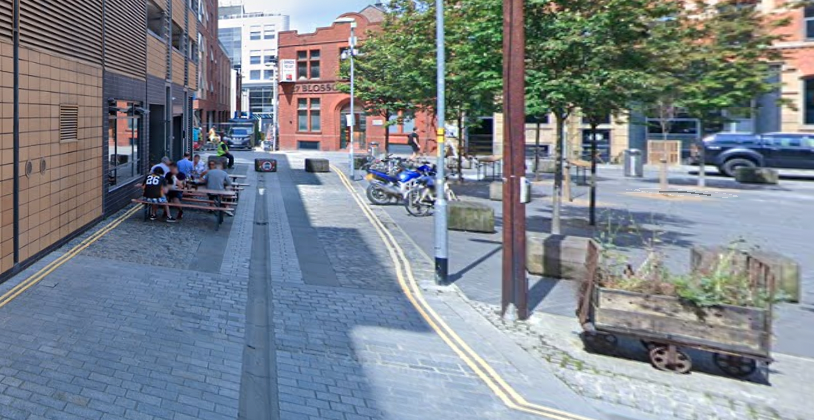

A classic street name, very apt for Manchester given it's history in spinning cotton. So famous was Manchester in processing cotton that in Australia bedlinen is called Manchester. Can't imagine saying "time to wash the Manchester".

It's very understated and I could only find one sign naming this street yet it runs right by the side of Cutting Room Square, arguably the heart of Ancoats and epicentre of perennial littering complaints about out-of-town visitors. 

This street has seen enormous change and now it's surrounded by buildings from the 00's onwards.

## 8 - Bunsen Street

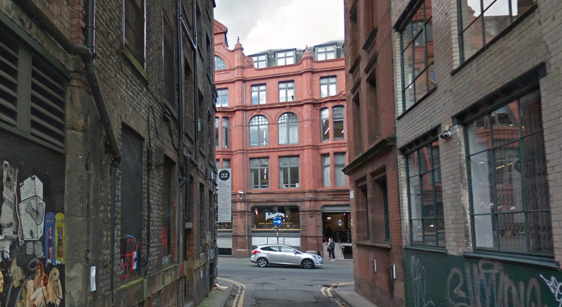

This is just a cool name right. It is one of a few science themed streets that can be found in Manchester, usually collected around the Northern Quarter and Ancoats.

Bunsen Street has a bit more to it than meets the eye - [some of it was stolen, and the rest was renamed](https://chorltonhistory.blogspot.com/2016/09/lost-and-forgotten-streets-of_16.html). It used to be called Bennet Street, and stretched between Little Lever Street (a very cute name of it's own), Lever Street, and Spear Street. However, when Sevendale House was [constructed between 1903 and 1906](https://manchesterhistory.net/manchester/tours/tour4/area4page46.html), they stole a bit of this street and renamed the rest, and now it only stretches between Little Lever Street and Lever Street.

Shoutout also to Faraday Street in the Northern Quarter, but I couldn't find as much history on this street (though the phone coverage is excellent so it's not quite living up to its name).

## 7 - Dark Lane

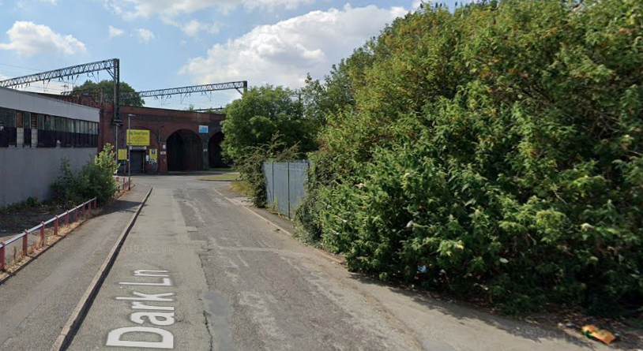

Set in Ardwick near the very surprisingly unknown and abandoned river walk through Pin Mill Brow (by the Currys Discount Store if that jogs your memory) you can almost smell the fumes from the traffic. 

It looks as if there was once a [Ragged School](https://manchestervictorianarchitects.org.uk/buildings/ragged-schools-ainsworth-street-dark-lane-ardwick) there - the Victorians really didn't mince their words - in 1872 when the corner stone was laid by Ainsworth Street.

According [to a historical map](https://maps.nls.uk/view/126522845) Ainsworth Street has at some point been renamed to Adlington Street and today there's a generic car dealership leaving only a small section of street left, which in true Manchester fashion is used as surface parking. 

Nonetheless, this is a cool sounding street and remains industrious with many commercial units on the street. I'm sure at night it's a very dark lane and given it's location it's likely this sees some exchanging of money for goods and services at night too.

## 6 - Gun Street

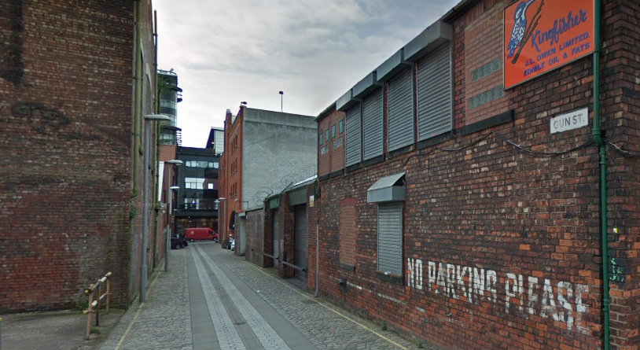

It sounds threatening, but we are back in Ancoats for this street. 

Apparently [once home to the Italian community](https://chorltonhistory.blogspot.com/2016/03/on-gun-street-in-ancoats-looking-for.html) in Manchester in the late 19th century, and known as "Little Italy". Around the same time Manchester also had a "[Little Ireland](https://en.wikipedia.org/wiki/Little_Ireland)" near Oxford Road station. Safe to say that living and working conditions were not great, and in particular Little Ireland featured in "[The Conditions of the Working Class in England](https://www.marxists.org/archive/marx/works/download/pdf/condition-working-class-england.pdf)" by Friedrich Engels.

In the 50s and 60s there was an Italian Week held annually in Manchester, where "Italian culture, fashion, manufacturing, produce, films, language, cars & motorbikes, and food and wine were all on display" ([source](https://www.ancoatslittleitaly.com/page7.html)).

I for one think this needs bringing back!

## 5 - Scotland

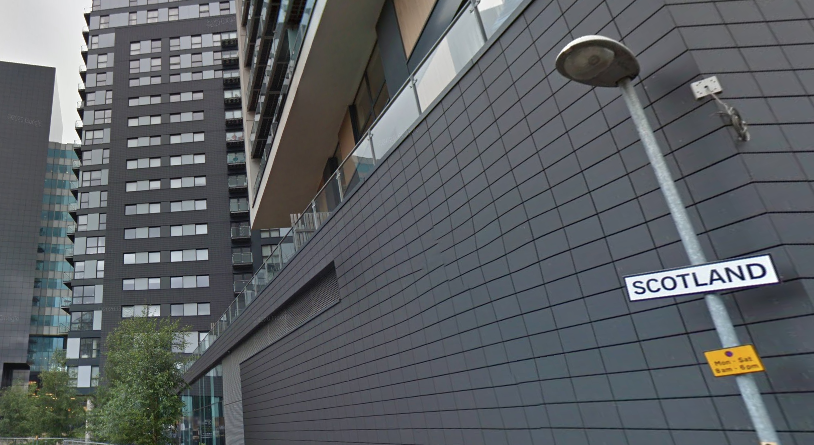

Yeah WTF. 

I'd hoped this was just some fuckery from the developers of the Green Quarter (who like many developers of the era, built highly combustible apartment blocks causing [misery and financial ruin to thousands](https://www.insidehousing.co.uk/insight/insight/a-second-wave-of-cladding-remediation-the-story-of-green-quarter-70994) and are clearly not to be trusted under any circumstances), but I'm slightly devastated to see evidence of this street name before [at least 1922](https://luna.manchester.ac.uk/luna/servlet/detail/maps002~1~1~335743~123007?qvq=q%3AJRL1300007%3Bsort%3Areference_number%2Ctitle%3Blc%3Amaps002%7E1%7E1&sort=reference_number%2Ctitle&mi=0&trs=1&cic=maps002%7E1%7E1).

It's not even called Scotland Street, it's just "Scotland". Like the country. The one with the Irn Bru.

This also makes searching for details on this street difficult, but from what I can see it has something to do with a wee scuffle for power during the 
[Jacobite uprising](https://en.wikipedia.org/wiki/Manchester_Regiment_(Jacobite)) which the Manchester Regiment played a part in. So this street does in fact have noteworthy history.

 History that's about religion, kings and queens, or people with large egos bores me to tears, so if you want to read more check out [Sky History](https://www.history.co.uk/articles/a-brief-history-of-the-jacobite-risings) which has an accessible overview to newcomers.

Nonetheless, I'll stop blaming the developer for this street name from now on.

## 4 - Mincing Street

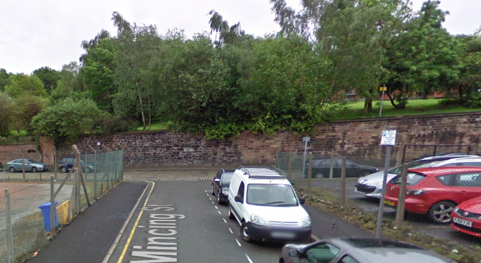

This is my kind of street. It sounds so fabulous yet industrial. 

Perpendicular to the [history steeped](https://manchesterhistory.net/manchester/tours/tour16/area16page8.html) Angel Meadow is Mincing Street. It's now surrounded by super shiny towerblocks for "aspirational renters" and "overseas investors who have dirty money to get rid of". 

But this street in of itself is special - it's next to [Charter Street ragged school](https://manchesterhistory.net/manchester/tours/tour16/area16page7.html) which is a fascinating building and still to this days carries it's signage. However it's nowhere near a Charter Street. 

Digging an [old map](https://luna.manchester.ac.uk/luna/servlet/detail/maps002~1~1~335715~123005?qvq=q%3AJRL1300005%3Bsort%3Areference_number%2Ctitle%3Blc%3Amaps002%7E1%7E1&sort=reference_number%2Ctitle&mi=0&trs=1&cic=maps002%7E1%7E1) out from 1892:
* Dantzic Street was in fact called Charter Street
* Mincing Street was called Nelson Street 

Yet by 1908, Nelson Street was renamed to Mincing street but Charter Street still existed. I'm not sure what happened between 1892 and 1908 that caused Nelson to become Mincing, but there's a few other street name changes in this area too, and given this was one of the worst areas of Manchester (literally described as "hell upon earth" by our friend Engels) maybe they were trying to regenerate the area and shake off the awful reputation. 

There's even a [book](https://angelmeadowbook.com/) on Angel Meadow, and often many very nice dogs if you choose to go for a stroll around it.

## 3 - Sparkle Street

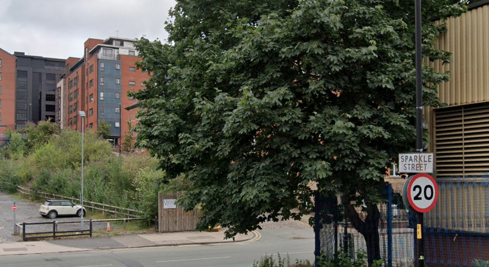

This street name always brings me joy when I see it.

But Manchester had no Sparkle (Street) in 1851 - it looks like at one point it was Berry Street. There was also a nearby School Street which I thought was it's predecessor, but this was renamed to Stand Street by 1935, by which point there was already a Sparkle Street. So Berry became Sparkle.

What's coolest about this street is there's a small sidestreet from it, barely noticeable, but the building has two street signs on it of two different street names. Looking at the 1851 map, it was called Lomas Street, but was eventually renamed to Leycroft street, which it remains today. The fact these two signs survive is fascinating.

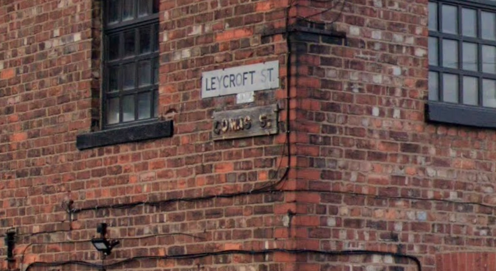

I have no idea why they renamed Berry Street to Sparkle Street but I like it. Maybe as it's on a slope, the road sparkled when it rained. The only noted industry there I could find was a timber yard, so it's possibly not industry related. It's a wonderful mystery.

There also used to be a Malaga Street (sounds lovely) which no longer exist, but would have continued where Sparkle Street turns left and becomes Chapeltown Street, and connected onwards to Baird Street.

## 2 - Radium Street

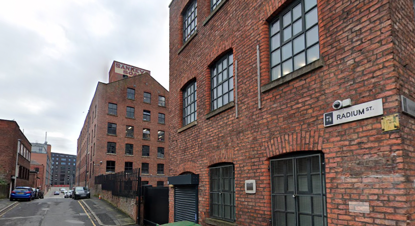

Get your hazmat suit on, we're going through the Northern Quarter to Radium Street in Ancoats. I jest, there's (probably) no actual Radium on Radium Street, and the Northern Quarter only needs a hazmat suit on Friday and Saturday nights. 

What's fun is that this used to be German Street back in 1888. At some point after it was renamed. But for why? This street fits in with nearby streets named after places: Poland Street and Portugal Street, with nearby Gibraltar Works.

By 1934 it was Radium Street, so this predated World War 2. But Word War 1 (The Great War) could well have been why German Street became Radium street - the Allied Powers (of which the UK was a part) were at war with the Central Powers (of which Germany was a part) and so it may have been necessary to remove the word German from the map.

Indeed in the 1922 map, it's already Radium Street so I'm going to guess that's what happened.

I wonder why they chose Radium though?

## 1 - Every Street

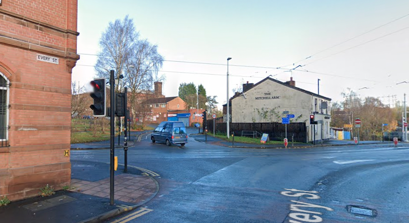

The **best** street name in Manchester by a mile.

The carnage it causes when TfGM has to close this street is hilarious - [Twitter](https://twitter.com/OfficialTfGM/status/574164805449285632) has many amusing and astonished replies to announcements that Every street is closed. 

There is however a difference between every street and Every Street.

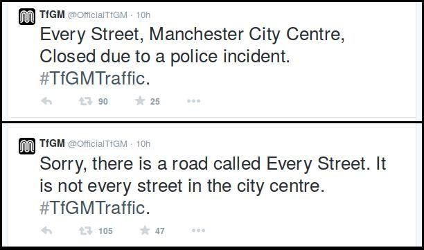

I remember when TfGM had to apologise for the confusion as hundreds of motorists panicked that they couldn't get into town if every street was closed, when in fact it was just the singular Every Street.

At least as far back as 1851 this was called Every Street, so it's not a new thing designed to antagonise. 

I've sometimes wondered how this street name has lasted so long - I would have expected it to be renamed to something like Energy Street to save confusion both when giving directions as well as when it needs closing. 

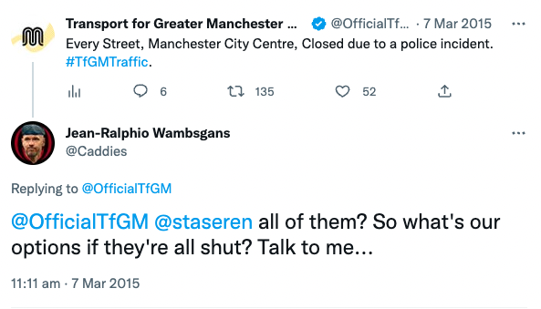

I can imagine it's not fun calling an the emergency services to Every Street and having to do the whole dance of "no not every street, there's a single street called Every Street" while the house is on fire.

Either way it's a gem, and is by far my favourite street name in Manchester.

## Honourable Mentions

There are many amazing street names in Manchester, but I only picked my favourite ten. Some, while amazing, didn't make it into this list.

* Jutland Street (It's super steep - we measured it!)
* Lizard Street (I really want to know the backstory here)
* Little Lever Street
* Loom Street
* Poland Street

## Thanks and credits
I've tried to link all sources I used in the making of this. My list of favourite street names is my own, and my research was done by me. I'm not a historian at all, so I've probably made mistakes somewhere, get in touch (email me, mcrst@ this domain) if there's something glaringly obvious I've missed or something that's wrong (please include a source with your message). 

As always big thanks to the plethora of Manchester History sites, it's a joy to dive into [Manchester History](https://manchesterhistory.net/) or [Graces Guide](https://www.gracesguide.co.uk/Main_Page) and find out some fascinating stuff about how the world used to work. I found the historical maps through [Old Maps Online](https://www.oldmapsonline.org/map/manchester/JRL1300080) which is another amazing resource.
