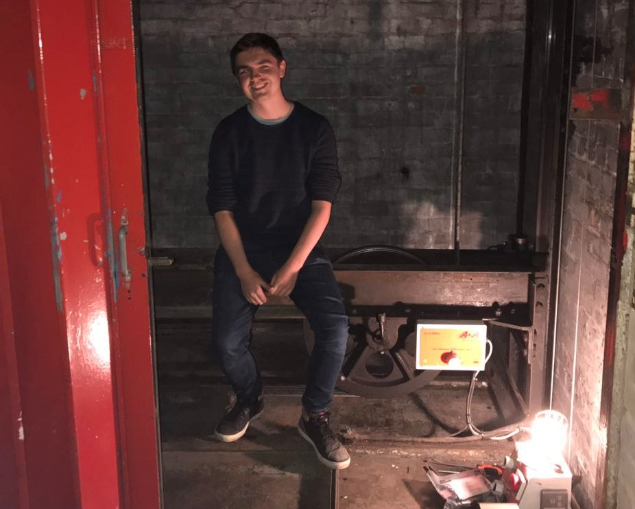

## Back again

This is my latest blog, set up in Gatsby and hosted on GitHub. Neat.

When the pandemic hit, I, like many decided to better myself and get Things done. 

One of those Things was to refresh my website, but the reality was that pandemics are somewhat stressful, and mindfulness (read: sitting on the roof with a coffee) became a higher priority.

Writing is often fun and helpful but like a lot of projects things don't always get to a state where I'm happy to publish them. Those that do get published are never perfect, but usually the process of writing is what's needed.

## Long Covid   
Another thing I didn't know was hiding just around the corner, was the curious horror that is Long Covid. 

I got a fairly mild Covid infection, figured I was about to get better but kind of didn't. If anything, things got worse after the initial infection - it's surreal as every virus I've ever had has handed me back to myself after a few days or weeks - I have a strong immune system after all. 

Instead, things fell apart in many awful ways. This experience will be written in another post. The short of the long is that I'm well enough to write again.

## What happened to Wordpress
Wordpress happened to it. As with any Wordpress installation, it requires hosting, updates, and general maintenance. I wasn't making use of anything specific to Wordpress, so hosting it was unnecessary.

So here we are.
