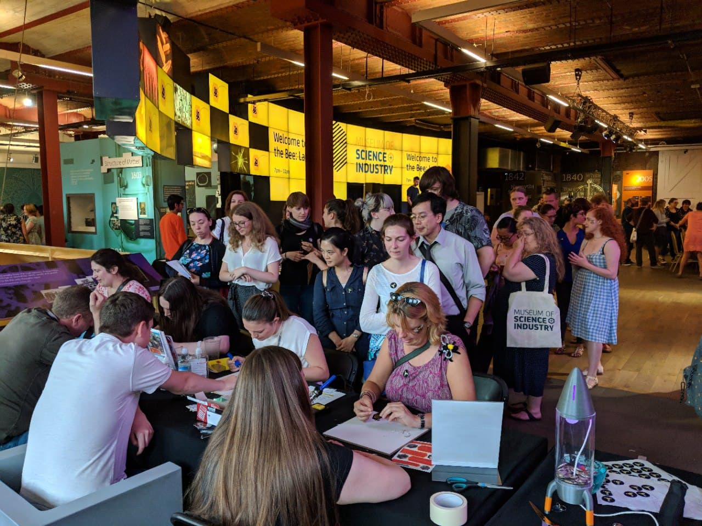
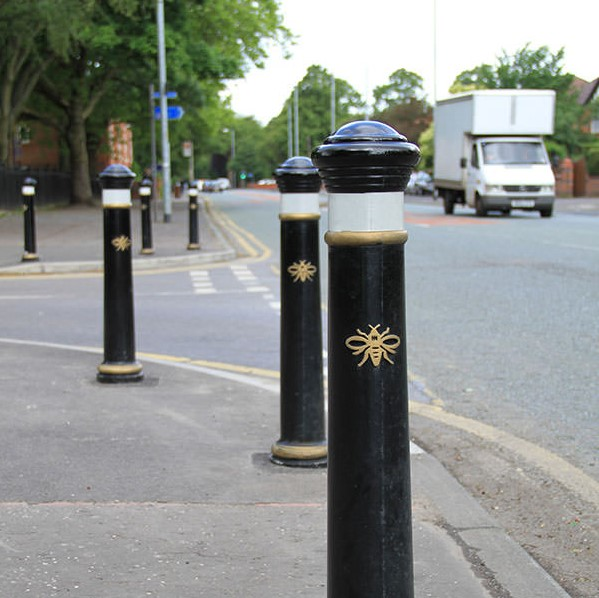
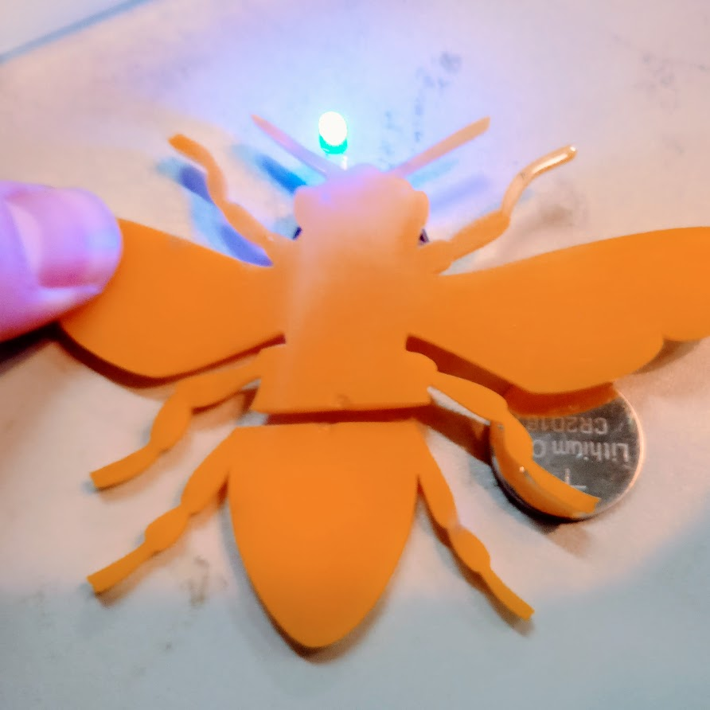
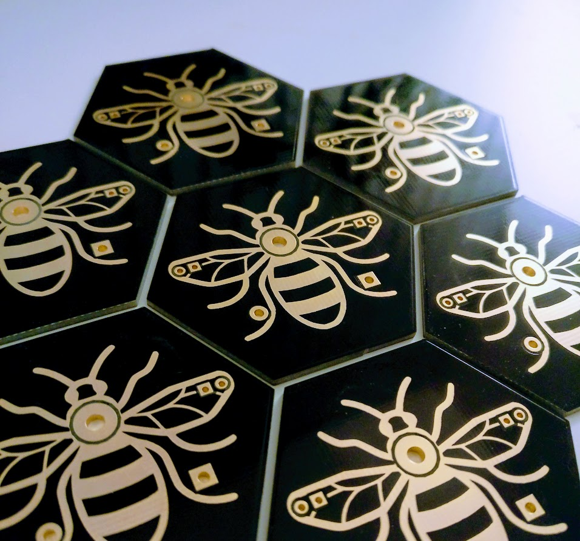
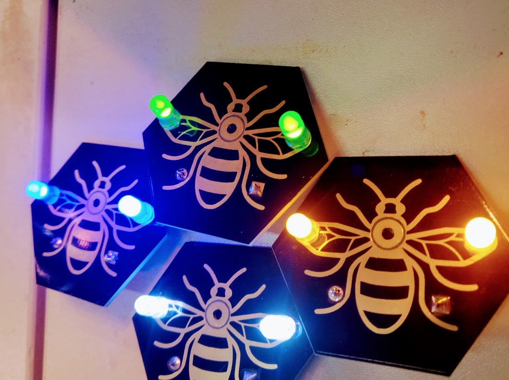
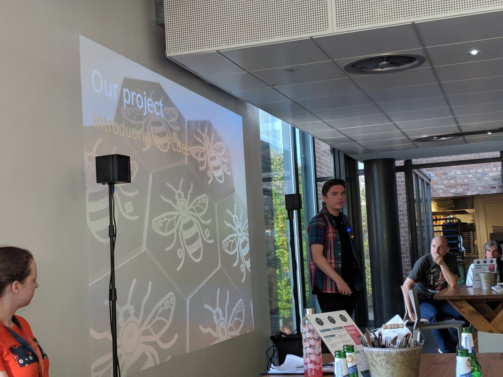
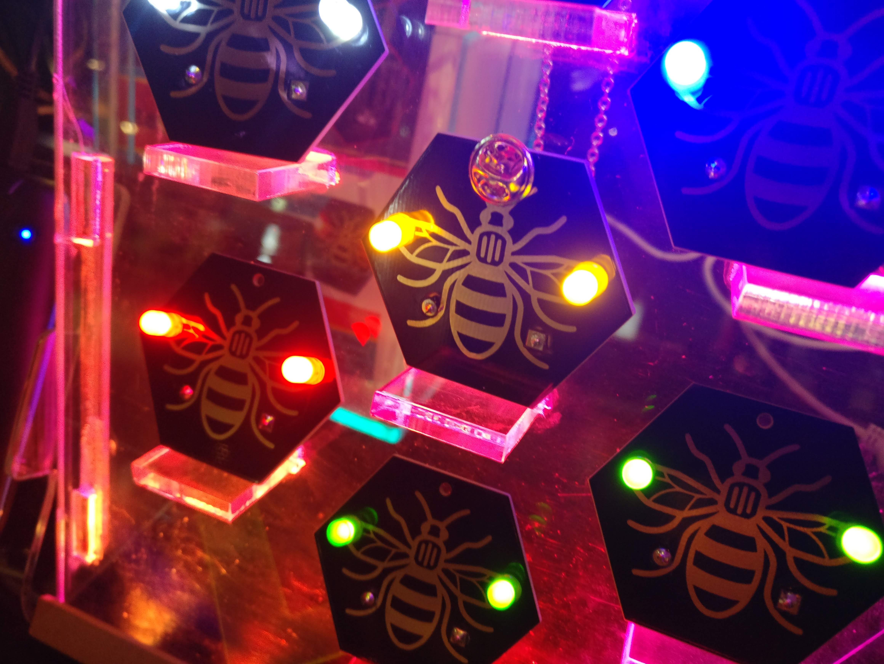
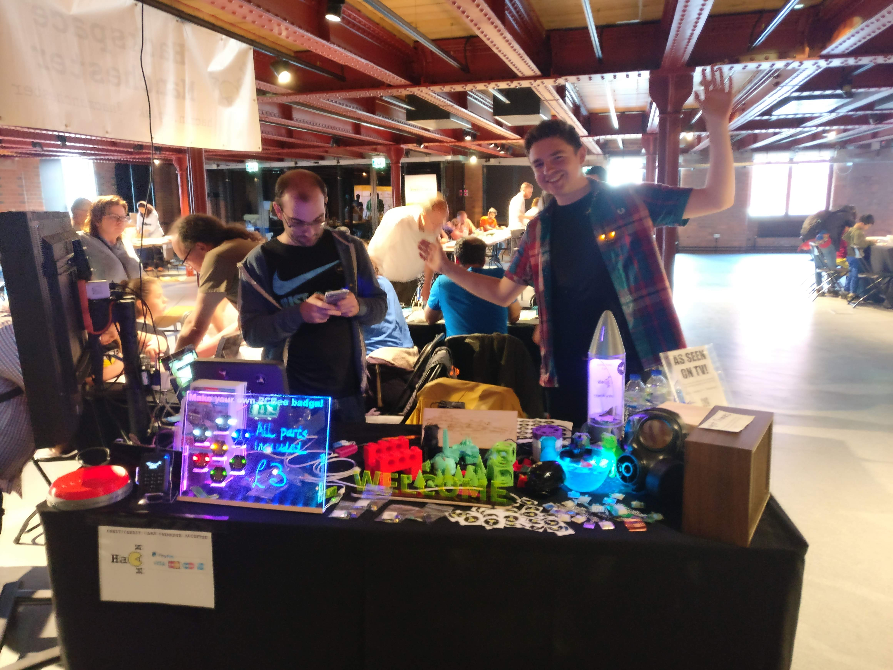

It was a bitterly dark and cold February evening and the rain was hammering on the windows at the hackspace. A few of us were huddled under the heat lamp working out what we could do for MakerFaire and MakeFest. 

MakerFaire (now retired in the UK) and MakeFest are key dates in the calendar of any maker, a chance to show what you do and find out what other's have been doing. You can usually buy components, art, and kits, as well as talk to so many different people. 

We were going, but we wanted to come up with an activity that the public could do and enjoy.

## To Bee or Not to bee
Time for a short history lesson - the symbol of Manchester is the worker bee.

 

It's a (slightly rose-tinted) nod back to the industrial revolution when Manchester was full of textile mills and a hive of industrious activity. It still is industrious, but the mills are mostly now trendy flats (or the hackerspace) and the industrious activity is usually over a latte or foosball table.

The bee emblem can be found all over the city, and it may well have been the *inexplicable* appearance of a bee-emblazoned bollard in the space that gave me the idea that we should do something around the worker bee. It represented making, working hard, being industrious, creative and coming together (while nicely ignoring the less savoury aspects of industrialisation such as working conditions).

 As quickly as the bollard appeared it disappeared, but the idea stayed.

## Prototyping

Using the laser cutter I made a quick acrylic bee and using an LED and battery, we had a prototype. 

With this prototype, I was thinking we could offer an activity where people would assemble and colour in the bee, wearing it as a badge.

However a brilliant idea someone else had was to make a custom bee themed PCB which people could solder. And right there, the PCBee was born.

The idea was instantly attractive, we had all the skills in the room, and as [soldering is easy](https://mightyohm.com/files/soldercomic/FullSolderComic_EN.pdf), it was the perfect activity for the public - they'd leave with something cool, having made it themselves. The excitement was palpable, so much so it was at least 3am by the time we all left the space. 

## Making a PCB

I was very fortunate that a friend at the space was willing to teach me how to use KiCad software to design PCBs. This is one of the best things about hackerspaces and why you should join one - you'll find so many people with different skills and talents, and sometimes that combination is just dynamite.

The idea was a hexagonal board, with the drawing of the bee in the middle. It seemed easy enough with the help of someone experienced, but when I tried to do it alone I quickly got stuck! I designed the shape of the board, added the bee, and then placed two LEDs and a battery holder, connected them up, and added a small hole in the board for where the badge pin would go through.

The second stroke of genius was when someone suggested using ENIG (Electroless nickel immersion gold) - a technique where gold can be placed on the front of the board which would make a beautiful effect. This probably wasn't how ENIG was designed to be used - but that's the very nature of hacking!

With the PCBee v0 designed, my friend checked the schematics over (turns out I'd shorted the battery which would have made it become a very small heater, very temporarily) and he fixed the issue. We were ready to go ahead and get a small batch made up - from the fabulous Elecrow.

Receiving a bundle of bees in the post was exhilarating, and as you can see - they looked stunning. I rushed the space and we all soldered some up, and they worked!

It was time to get serious about this.

## Refining and pricing

During testing we found that the badge pin hole in the middle interfered somewhat with the depth of the battery holder, meaning it was tricky to wear as a badge. We didn't want people struggling, so we moved the hole to the top of the badge. Without time to do another prototype run, we did something scary and ordered 500 badges trusting they would be otherwise fine. It was tense but I think we all knew it would be okay.

We booked our place at Maker Faire and rallied a wider team together of people who would come up to MakerFaire in Newcastle and help out (it's really good fun and so we had lots of volunteers!)

We also had to get parts:

* LEDs, two per badge, plus some margin for error. We wanted a mix of colours so people could personalise their badge, including colour-changing rainbow LEDs.
* Battery holders
* Batteries

These were all costed out in order for us to understand what the profit margin would be (anything over 0 would be excellent). We then had to set a price point - we had NO idea what people would pay for them, if they would pay at all. As we were just a group of friends making this, profit wasn't a factor, and we would have been quite happy if we just broke even.

We figured that going for pocket money amounts would likely be successful, so we priced them at £4 for the kit, and £6 assembled - this way people who wanted to solder them could do so, but those that wanted to just buy one would pay a small premium for a pre-packaged one.

Risk assessments done (namely "don't touch the shiny part of the soldering iron - you'll let go very quickly" and "don't eat the batteries") we were good to go.

In the days before the event started, we had crates of stuff packed, a cash float, money box, card reader, a box of projects to show, and piles of parts. 

We bought IKEA and Clas Ohlson out of batteries, as our cheaper eBay delivery was cutting it a bit close, even with marginal extra expense, it meant we had a good deal of reassurance we could deliver the project, and should still get our money back.

The final thing, just like in The Apprentice, was to discuss and agree upon our strategies - both for how we teach people to solder, and how we change the pricing if we need to. We agreed that we could go as low as £3 if we had to, and with a cash float, boxes of leaflets and promotional stuff for the space (as well as projects and a monitor showing a slideshow), we packed our stuff, and headed for MakerFaire.

## The event

MakerFaire 2018 was a weekend-long event, held in Newcastle. It was in the Life Centre - a fantastic science centre and huge building, just minutes from the train station. We rolled up with anticipation and nerves - a Maplin store located nearby in case of any crises involving broken soldering irons.

I'll be honest, I was dismayed when I saw the room we were in. It was about as far away from the main door as possible, up some stairs, and through a room of exhibitors which could be very easily missed. I feared we would have no visitors at all and felt gutted before the event started. We held it together and got the stand set up as best we could.

Thankfully some on our team were naturally good with people, and had a plan to go out wearing the badges, chatting to everyone passing, and directing them our way. 

Someone had the clever idea of giving out some PCBee badges to staff, so that all day long people would be seeing them and asking where they got them. It worked, and a couple of hours after opening we were soon overrun! 

### Teaching people to solder
It is so much fun teaching people to solder.

We had a really nice mix of adults and kids come along, and the vast majority hadn't soldered before and were clearly excited and apprehensive. After the briefing advising them that the shiny bit gets hot, people picked up the soldering irons, and embarked on making their first ever solder connection. 

It was amazing to see and really feel the pride and excitement from such a simple board. People wore their newly made bees with pride, and I just knew that the hands-on experience of learning, and the feeling of success would be making memories.

We also had no injuries throughout the event, which meant no paperwork! Double success.

### End of Day One
About to collapse, and tidying up our stand for day two, we totted up how many sales we'd had. From just day one of the event, we had already broken even. I was so delighted, the bees really had flown. We went for a savagely mediocre pizza (which nonetheless felt like heaven after the day), and started to fall into respective food comas. 

As we tried to perk ourselves up by migrating to a slightly-sticky dessert parlour which had music just a bit too loud and smelled distinctly of purple, we rejoiced that it didn't matter what happened tomorrow - we'd made our money back, people loved them, and we were having great fun. We could just enjoy the next day for what it was.

### Day Two, and scheduling
One thing we had to contend with very quickly on the busier Sunday was scheduling people so we could all have a proper lunch and rest breaks without anyone burning out. We also very quickly needed to make sure that the person with access to the cash box didn't wander off, so with a rainbow lanyard in place we had a clear indicator of who was in charge of what.

### Collapsing back home
Comprehensively exhausted, the car was rammed haphazardly full of items - LEDs overflowing, batteries falling into every corner - and trains were installed with hackers. We set off back to Manchester, all in good, but quiet spirits, as we all took turns to ungraciously nod off (except, thankfully, the train and car drivers).

Arriving at the space and running on fumes, we poured the contents of the car into the goods lift and pretty much shovelled it into the space with a note saying "it'll get tidied up soon but not right now as we're all about to collapse".

One further pizza, so big it needed three little tables to prop the lid up, and I think I was about ready to sleep for a year. Thankfully the next day I'd booked off work - one of those times where I could have hugged past-me.

We spent £300 in total, and our takings for the one weekend were £700. The event was a huge success from the value delivered anyway, but the profit (which went back into the space) quantified it even more.

## MakeFest 2018

MakeFest is a similar event to MakerFaire, and was hosted in May in Manchester's amazing Museum of Science and Industry. 

We were already signed up and excited to go, and with everything in place we rocked up and taught many more people how to solder. Having had our first go, and aware that they were popular, we went in prepared, and had another great time.

In the evening we were treated to pizza, and I gave a short presentation on the creative process in making the PCBees. This was also a two-day affair, so on the Sunday we taught hundreds more to solder.

Teaching is such a humbling experience as not only do you get to share, and the other person is eagerly listening and internalising a skill that will be remembered for decades. There's also a real element of care when teaching - you want them to succeed, and enjoy the experience and they need that bit of support.

Different people had different levels of confidence, so it was good fun trying to pre-empt what the next person would want in terms of guidance. One after another, seats never vacant, we taught and taught.

## Bee: Late 

The final event that the bees appeared at was the Bee: Late event at the Museum of Science and Industry - an adults only event in the evening where people could learn, make, and have a beverage too.

We had a small amount of funding which we used to make the final event totally free - people could rock up and solder a PCBee at their leisure. We gathered all our remaining supplies and went fully for it.

It was extra great to see people post about their bees online: 
https://twitter.com/Meow_Jiggler/status/1022233458750488576

It was a brilliant swansong to a series of events which really brought us and others together.
